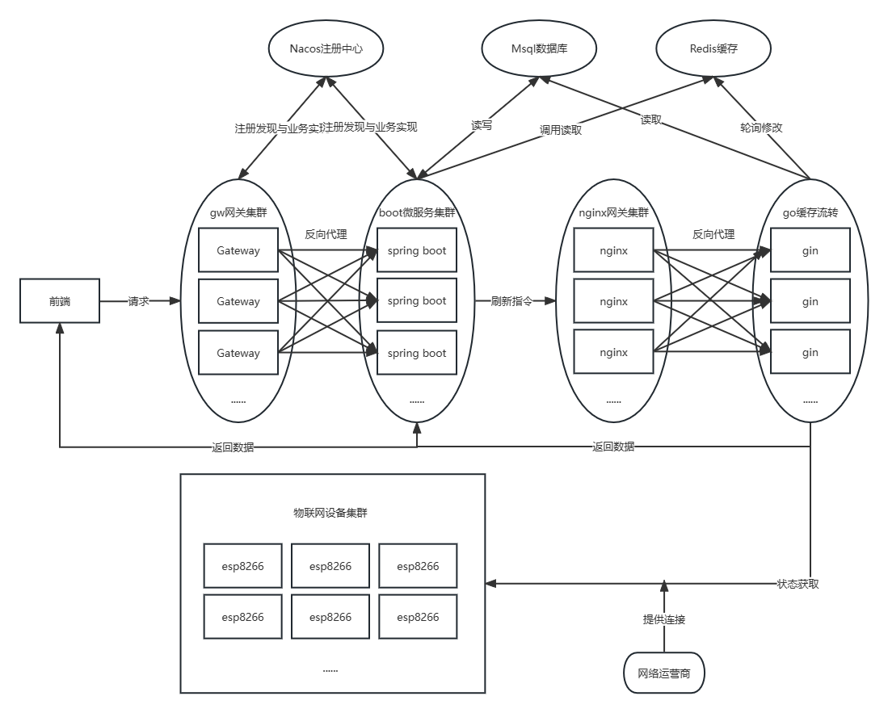
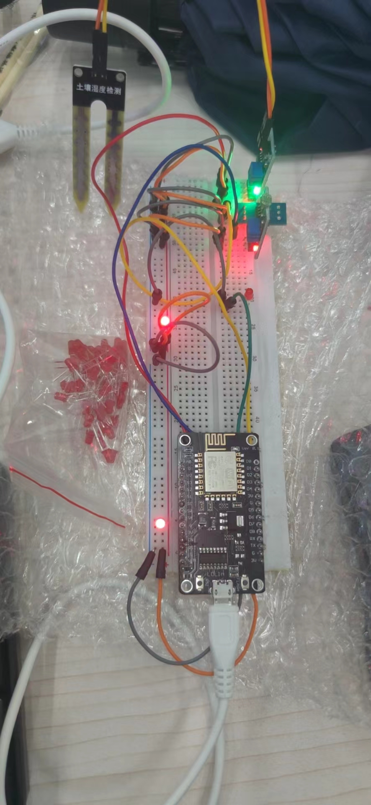

# Green Belt
### 基于大数据和物联网的可视化城市绿化带自动灌溉系统
> ##### *A Visualized Urban Greenbelt Automatic Irrigation System Based on Big Data and Internet of Things*
>

1. #### 项目结构图

   #### 

2. #### 网页前端界面

3. #### APP/小程序界面

4. #### 物联网设备面包板单机图

   #### 

5. #### 后端部分

   开发环境：Idea2020，Maven3.6，Java1.8，Nacos1.4.1，Goland2021，Golang1.20，Git

   Java应用技术：Spring Boot2.7.11，Spring Cloud，Spring Cloud Alibaba，Nacos，Gateway，Mybatis，Lombok，Thymeleaf，nife4j-openapi2(swigger2)，Hutool

   Go使用技术：Gin，xorm，Redigo，一种采用Java多线程底层队列思想和Go程信道特性制作的物联网硬件状态检查轮询机制

   说明：采用[混合型分布式架构](#其他说明)，分布式集群中可包括多后端服务器(可使用不同编程语言实现业务逻辑)和多物联网硬件设备，后续可以拓展注册中心集群和各种微服务达到亿级访问量承载，以实现全国范围绿化带管理。演示项目中业务主控服务器由Spring Boot Web(java框架)框架支持，轮询各硬件设备状态由Gin(Go框架)服务支持

   项目中对应文件夹：backend

6. #### 前端部分

   环境：Node，Vue3.0，Vue2.0，HBuilderX，VS code，@vue/cli

   Node前端应用技术：@vue/cliV，ue2.0，Elementui-Plus，Vuex，Vrouter，Axios，Echarts，uiverse.io

   网页部分说明：ElementuiPlus框架自带的响应式布局，会有Github Page和Gitee Page等演示界面

   App部分说明：使用Uniapp可打包Android应用，iOS应用(需要加入App开发者联盟)等，我们演示项目只打包Android应用作为演示

   小程序部分说明：由于我们使用Uniapp一站式开发，小程序随时可以打包，是否上线小程序还待考虑

   说明：我们采用前后端分离的思想，并尽力消除跨域时出现的问题。本项目响应式网页和App使用两次不同的模式进行开发(Vue，Uniapp)，其一致力于网页端可视化的体验，另一致力于App和小程序的体验

   项目中对应文件夹：frontend

7. #### 硬件部分

   环境：ESP8266开发板，ArduinoIDE，嘉立创EDA专业版

   应用技术：C语言，模块图纸及相关文档，常用硬件开发库

   使用库：ESP8266WiFi，ESP8266WiFiMulti，ESP8266WebServer，OneWire，DallasTemperature，stdio

   项目中对应文件夹：esp8266

   点模式：像共享单车一样每台物联网设备都加入联网模块把物理机本地接口映射到互联网上,每台机器的公网ip注册到服务列表中

   伞模式：附近区域一些物联网设备连接同一个中枢设备统一进行以端口号区分设备的端口映射实现一定物理范围内设备服务可被发现

8. #### 数据库部分

   环境：MySql，Redis，Navicate，RedisInsight-v2

   说明：MySql作为长期静态数据数据库，Redis作为缓存数据库用于更新物联网设备集群中各个设备状态

   项目中对应文件夹：database

9. #### 网关部分

   使用网关：Nginx，Gateway

   说明：对于实时更新设备状态层集群使用nginx反向代理，对于后端接口以及数据库调度等使用注册到Nacos注册中心的Gateway服务网关代理

   项目中对应文件夹：gateway

10. #### 端口

   Nacoc注册中心端口：8848

   Nginx网关端口：96

   Gateway网关端口：8888

   Node前端端口：8080

11. #### 其他说明

    完整性：由于本项目为比赛项目，缺少设备和时间，我们对单个物联网集群设备只进行了基础实现

    混合型分布式架构：我们使用手写的方式实现分布式请求和Spring Cloud Alibaba系列注册中心Nacos提供微服务可拓展性相结合，大幅度无上限提高运行稳定性和效率。我们的演示项目是单台设备运行，单台服务器部署，可能无法体现优势。

    不足：硬件层面，缺乏硬件设备(继电器，水泵，蜂鸣器等)我们均使用红色发光二极管代替

    主题：开发主题为“行业数字化”，本项目为城市绿化数字化管理项目

    开源：为了提供学习价值，本项目会在比赛投稿截止后开源

12. #### 本地复现

    - mysql数据库：

    ```mysql
    本地需要有较新版本的mysql，可以在docker容器或虚拟机或外部物理设备等，只有能访问到即可
    创建数据库名为GreenBelt（改成其它名字需要修改其他后端代码）
    执行'database/mysql'中的日期最新的一组sql脚本进行快速建表
    （如果想手动建表自行观察表结构建表）
    修改java，go后端集群部分中的配置信息（表名，用户名，密码等）
    ```

    - redis数据库：

    ```sql
    部署可被访问到的redis
    修改java，go后端集群部分中的配置信息（用户名，密码，是否有密码等）
    ```

    - go后端服务：

    ```go
    联网导入依赖
    可以选择使用goland直接执行项目
    或进去文件夹后执行下列cmd命令
    go run GreenBeltGoRun.go
    ```

    - nginx网关服务：

    ```yml
    下载可用的任意平台nginx发行版
    使用以'gateway/nginx反向代理'为例的反向代理配置文件代理全部指向go后端集群的每台单机设备的地址
    nginx -s reload
    ```

    - nacos注册中心：

    ```yml
    下载Nacos1.4.1
    修改配置文件中的集群模式和数据持久化模式
    执行startup运行nacos服务
    将nacos服务置于后台或者服务中
    ```

    - gateway网关服务：

    ```
    修改nacos发现配置
    添加springboot集群中的各个表层同级服务到配置文件中反向代理
    修改配置文件中跨域限制
    使用idea编译运行或自行使用Java命令执行
    ```

    - SpringBoot后端服务：

    ```
    使用maven联网导入依赖
    使用idea编译运行或自行使用Java命令执行springboot项目
    ```

    - Node前端服务：

    ```javascript
    npm i
    npm run serve
    访问地址
    ```

    - 小程序/App：

    ```
    直接安装、访问即可
    ```

    - 物联网设备：

    ```
    根据'esp8266/原理图'购买硬件组装或焊接（或直接打板焊接）
    刷入'esp8266/烧录程序'固件
    ```

By：tyza66(洮羱芝闇/孙达明)，morsite(Li Bling/李亮)
